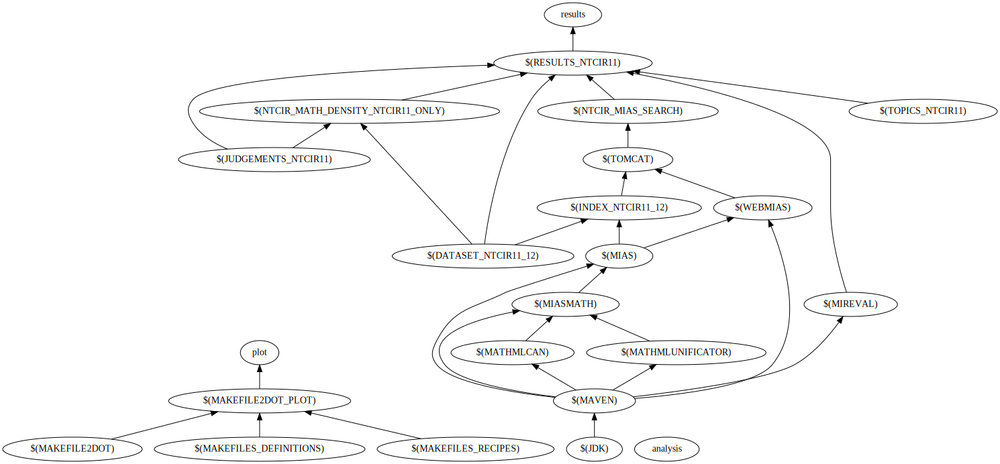

NTCIR MIaS Search Deployment – Evaluates [NTCIR MIaS Search][ntcir-mias-search] on NTCIR Math datasets
======================================================================================================

NTCIR MIaS Search Deployment is a [GNU make][make] makefile that automates the
deployment of [WebMIaS][], and the configuration and execution of the various
MIR packages, resulting in an evaluation of the [NTCIR MIaS
Search][ntcir-mias-search] system on the NTCIR Math datasets.

 [make]: https://www.gnu.org/software/make/manual/make.html
 [ntcir-mias-search]: https://github.com/MIR-MU/ntcir-mias-search
 [WebMIaS]: https://github.com/MIR-MU/WebMIaS

Usage
=====
Performing a clean run
----------------------
Before running make, you will need to adjust the definitions of the following
variables in the file `definitions.mk` to match your environment:

- `CPU_NUMBER` – The number of threads the tools will use
- `TOPICS_NTCIR10_FS` – The path to the [NTCIR-10 Math][aizawaetal13-ntcir10]
  [topics][ntcir-task-data] for the math retrieval formula search subtask
- `TOPICS_NTCIR10_FT` – The path to the [NTCIR-10 Math][aizawaetal13-ntcir10]
  [topics][ntcir-task-data] for the math retrieval full-text search subtask
- `TOPICS_NTCIR11` – The path to the [NTCIR-11 Math-2][aizawaetal14-ntcir11]
  [topics][ntcir-task-data] for the main task
- `TOPICS_NTCIR12_QUERIES` – The path to the [NTCIR-12
  MathIR][zanibbi16-ntcir12] [topics][ntcir-task-data] for the arXiv main
  task
- `TOPICS_NTCIR12_SIMTO` – The path to the [NTCIR-12 MathIR][zanibbi16-ntcir12]
  [topics][ntcir-task-data] for the optional arXiv similarity task
- `JUDGEMENTS_NTCIR10_FS` – The path to the [NTCIR-10 Math][aizawaetal13-ntcir10]
  [judgements][ntcir-task-data] for the math retrieval formula search subtask
- `JUDGEMENTS_NTCIR10_FT` – The path to the [NTCIR-10 Math][aizawaetal13-ntcir10]
  [judgements][ntcir-task-data] for the math retrieval full-text search
  subtask
- `JUDGEMENTS_NTCIR10_FS` – The path where the converted [NTCIR-10
  Math][aizawaetal13-ntcir10] [judgements][ntcir-task-data] for the math
  retrieval formula search subtask will be placed by the [NTCIR-10 Math
  Converter package][ntcir10-math-converter]
- `JUDGEMENTS_NTCIR10_FS` – The path where the converted [NTCIR-10
  Math][aizawaetal13-ntcir10] [judgements][ntcir-task-data] for the math
  retrieval full-text search subtask will be placed by the [NTCIR-10 Math
  Converter package][ntcir10-math-converter]
- `JUDGEMENTS_NTCIR11` – The path to the [NTCIR-11
  Math-2][aizawaetal14-ntcir11] [judgements][ntcir-task-data] for the main
  task
- `JUDGEMENTS_NTCIR12_QUERIES` – The path to the [NTCIR-12
  MathIR][zanibbi16-ntcir12] [judgements][ntcir-task-data] for the arXiv
  main task
- `JUDGEMENTS_NTCIR12_SIMTO` – The path to the [NTCIR-12
  MathIR][zanibbi16-ntcir12] [judgements][ntcir-task-data] for the optional
  arXiv similarity task
- `DATASET_NTCIR10` – The path to the [NTCIR-10 Math][aizawaetal13-ntcir10]
  [dataset][ntcir-10-math-data]
- `DATASET_NTCIR10_CONVERTED` – The path where the converted [NTCIR-10
  Math][aizawaetal13-ntcir10] [dataset][ntcir-10-math-data] will be placed by
  the [NTCIR-10 Math Converter package][ntcir10-math-converter]
- `DATASET_NTCIR11_12` – The path to the [NTCIR-11
  Math-2][aizawaetal14-ntcir11], and [NTCIR-12 MathIR][zanibbi16-ntcir12]
  [dataset][ntcir-12-mathir-data].

 [aizawaetal13-ntcir10]: https://ntcir-math.nii.ac.jp/wp-content/blogs.dir/23/files/2013/10/01-NTCIR10-OV-MATH-AizawaA.pdf (NTCIR-10 Math Pilot Task Overview)
 [aizawaetal14-ntcir11]: https://citeseerx.ist.psu.edu/viewdoc/download?doi=10.1.1.686.444&rep=rep1&type=pdf (NTCIR-11 Math-2 Task Overview)
 [ntcir-task-data]: https://www.nii.ac.jp/dsc/idr/en/ntcir/ntcir-taskdata.html (Downloading NTCIR Test Collections Task Data)
 [ntcir10-math-converter]: https://github.com/MIR-MU/ntcir10-math-converter
 [ntcir-10-math-data]: https://ntcir-math.nii.ac.jp/data/ (NTCIR-12 MathIR » Data » NTCIR-10 Math Pilot Task)
 [ntcir-12-mathir-data]: https://ntcir-math.nii.ac.jp/data/ (NTCIR-12 MathIR » Data » NTCIR-12 MathIR Task)
 [zanibbi16-ntcir12]: https://research.nii.ac.jp/ntcir/workshop/OnlineProceedings12/pdf/ntcir/OVERVIEW/01-NTCIR12-OV-MathIR-ZanibbiR.pdf (NTCIR-12 MathIR Task Overview)

The following commands removing any results of the previous run, and builds all
targets:

```
$ make clean all
```

Make will be executed with maximum verbosity and a file named `Makefile.log` is
created in the current working directory, and contains all output along with
time information. The evaluation results will be stored in a directory named
according to the `RESULTS_NTCIR11` variable defined in `definitions.mk`.

Note that although the `clean` pseudotarget removes all results, you will need
to manually shut down any running instances of Apache Tomcat that were started
as a result of the previous runs.

Plotting a dependency tree
--------------------------
Executing the `make plot` command produces the following dependency graph of
the individual targets in the makefile:

 

Storage and time requirements
=============================
Disregarding the datasets that you need to download beforehand, make will
produce about 167G of data, out of which 93G will be [MIaS][] indexes, 51G the
converted [NTCIR-10 Math][aizawaetal13-ntcir10] [dataset][ntcir-10-math-data],
and 11G the final results.

The following table shows how long it takes on average to construct the
individual targets with 448G of RAM, and eight Intel XeonTM X7560 2.26 GHz
CPUs. Only targets that take longer than a minute are listed:

| Target name  | Wall clock time | Number of testing runs |
| ------------ | --------------- | ---------------------- |
| $(INDEX_NTCIR11_12) | 17h 53m 34s | 1 |
| $(INDEX_NTCIR10) | 9h 2m 56s | 2 |
| $(NTCIR_MATH_DENSITY_NTCIR11) | 1h 5m 30s | 4 |
| $(RESULTS_NTCIR11) | 53m 41s | 3 |
| $(NTCIR_MATH_DENSITY_ALL) | 52m 21s | 3 |
| $(NTCIR_MATH_DENSITY_ALL_WITHOUT_NTCIR10) | 41m 50s | 3 |
| $(DATASET_NTCIR10_CONVERTED) | 23m 26s | 1 |

 [MIaS]: https://github.com/MIR-MU/MIaS
